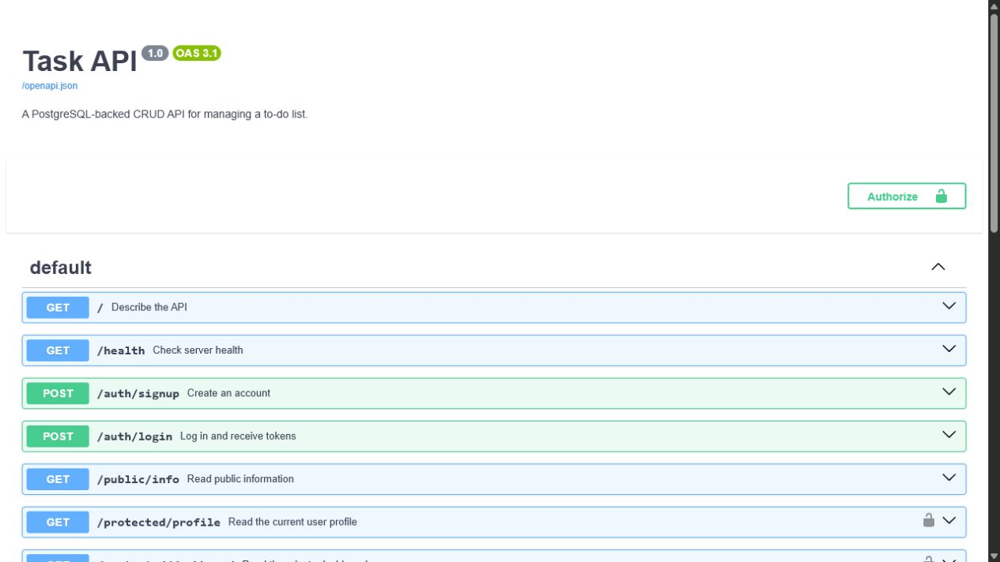

# Task API

A FastAPI to-do API with PostgreSQL persistence, Docker Compose, and Supabase authentication. Users can sign up, log in, send a bearer access token to protected endpoints, and log out.

Repository: <https://github.com/marwan886/task-api>

## Configuration

Copy the example file and replace its placeholders:

```bash
cp .env.example .env
```

On Windows PowerShell, run `Copy-Item .env.example .env`. Set `SUPABASE_URL` to the project URL and `SUPABASE_KEY` to the Supabase anon key. Never put the service-role key in this API or commit the real `.env` file. For assignment testing, email confirmation can be disabled in the Supabase authentication settings.

The same file also configures PostgreSQL:

| Variable | Purpose |
|---|---|
| `SUPABASE_URL` | Supabase project URL |
| `SUPABASE_KEY` | Public anon key used by Supabase Auth |
| `DATABASE_URL` | PostgreSQL connection string used by the API |
| `POSTGRES_PASSWORD` | Password used by the database container |
| `POSTGRES_DB` | Database created on first startup |

## Run the complete stack

```bash
docker compose up --build
```

The API runs at <http://localhost:3000> and Swagger UI at <http://localhost:3000/docs>. Stop it with `docker compose down`. The `taskdata` volume preserves tasks across restarts.

For local development with an available PostgreSQL server:

```bash
pip install -r requirements.txt
uvicorn main:app --reload --port 3000
```

## Authentication endpoints

| Method | Path | Access | Success |
|---|---|---|---:|
| POST | `/auth/signup` | Public | 201 |
| POST | `/auth/login` | Public | 200 |
| POST | `/auth/logout` | Bearer token | 204 |
| GET | `/public/info` | Public | 200 |
| GET | `/protected/profile` | Bearer token | 200 |
| GET | `/protected/dashboard` | Bearer token | 200 |

Sign up and log in with JSON credentials:

```bash
curl -X POST http://localhost:3000/auth/signup -H "Content-Type: application/json" -d '{"email":"student@example.com","password":"strong-password"}'
curl -X POST http://localhost:3000/auth/login -H "Content-Type: application/json" -d '{"email":"student@example.com","password":"strong-password"}'
```

Copy the returned `access_token`, then call a protected endpoint:

```bash
curl http://localhost:3000/protected/profile -H "Authorization: Bearer ACCESS_TOKEN"
```

The reusable authentication dependency asks Supabase to verify the token and returns `401` for missing, invalid, or expired tokens. JWT payloads are readable, so sensitive information must not be placed inside them.



## CRUD endpoints

The existing `/tasks`, `/tasks/{id}`, `/stats`, and `/reset` routes continue to use PostgreSQL. Unknown task IDs return `404`, invalid request bodies return `400`, and SQL values are parameterized.

## Tests

```bash
pytest -q
```

The automated suite covers CRUD plus signup, login, token verification, public access, protected access, and logout. Supabase is mocked during tests so credentials remain private; set the values from `.env.example` to exercise the live authentication service.
