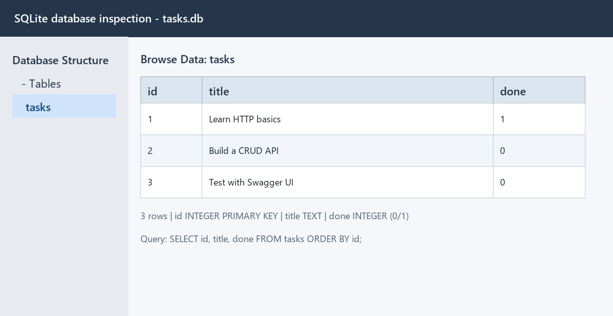

# Task API

A database-backed CRUD API for a to-do list, built with Python, FastAPI, and SQLite. It supports creating, reading, updating, and deleting persistent tasks, with interactive Swagger documentation.

Repository: <https://github.com/marwan886/task-api>

## Install and run

Python 3.10 or newer is required.

```bash
python -m venv .venv
.venv\Scripts\activate
pip install -r requirements.txt
uvicorn main:app --reload
```

On macOS or Linux, use `source .venv/bin/activate` instead of the Windows activation command.

Open <http://localhost:8000/docs> for Swagger UI. Tasks are stored in SQLite and remain available after the server restarts.

## SQLite storage

SQLite was chosen because it stores the entire database in one file, requires no separate database server, and survives application restarts. The application automatically creates `tasks.db`, creates the `tasks` table, and inserts three example tasks only when the table is empty.

`tasks.db` lives in the project directory and is excluded from Git so every clone starts with a fresh database. Run `uvicorn main:app --reload`; no manual database setup is required.



The API uses parameterized SQL queries for all client-provided values. For example:

```sql
SELECT * FROM tasks WHERE done = 1;
```

This returned only completed tasks. Changing rows through SQL is immediately visible through the API because both read the same `tasks.db` file.

## Endpoints

| Method | Path | Purpose | Success |
|---|---|---|---:|
| GET | `/` | Describe the API | 200 |
| GET | `/health` | Check server health | 200 |
| GET | `/tasks` | List, filter, search, or paginate tasks | 200 |
| GET | `/tasks/{id}` | Get one task | 200 |
| POST | `/tasks` | Create a task | 201 |
| PUT | `/tasks/{id}` | Update a task's title and/or status | 200 |
| DELETE | `/tasks/{id}` | Delete a task | 204 |
| GET | `/stats` | Count total, completed, and open tasks | 200 |
| POST | `/reset` | Restore the three example tasks | 200 |

Optional list parameters include `done=true`, `search=milk`, `limit=2`, and `offset=2`.

## Example

```console
$ curl -i -X POST http://localhost:8000/tasks -H "Content-Type: application/json" -d '{"title":"Buy milk"}'
HTTP/1.1 201 Created
content-type: application/json

{"id":4,"title":"Buy milk","done":false}
```

Try a complete create-update-delete cycle in Swagger UI at `/docs`.

## Run the tests

```bash
pytest -q
```

The test suite checks the full CRUD cycle, validation, 400/404 errors, filters, pagination, SQL statistics, reset behavior, persistence, idempotent database seeding, and Swagger/OpenAPI availability. The same endpoint tests still pass after moving from memory to SQLite, demonstrating that storage is an implementation detail rather than a change to the API contract.
